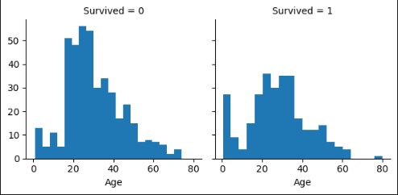
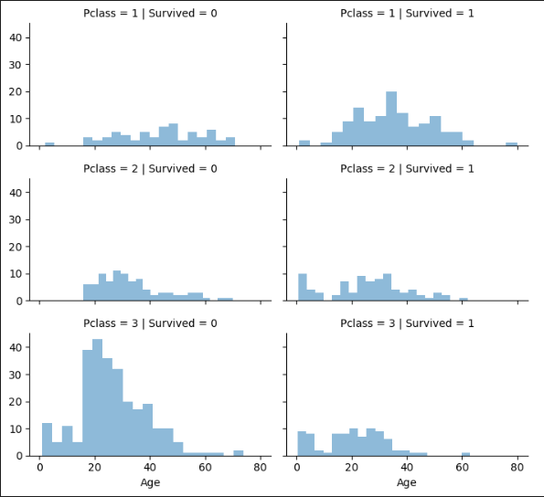
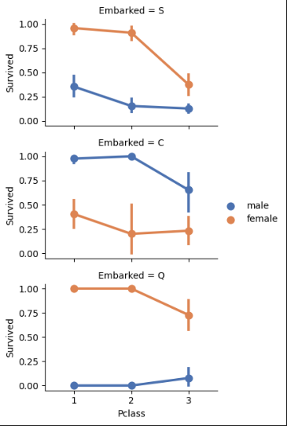
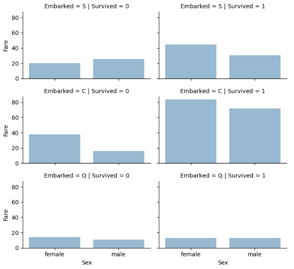

# Titanic Disaster Project : Project Overview

* Created a machine learning project that tends to predict whether passengers of Titanic ship survived the disaster or not.
* Collected the data to work with from kaggle website (from a competition called 'Titanic - Machine Learning from Disaster') already divided in train and test sets.
* Cleaned data up and engineered features so they will help us in the prediction process like extracting title of every passenger from their names.
* Optimized Logistic Regression, KNN, SVM, Gaussian NB, Perceptron, Linear SVC, Stochastic Gradient descent, Decision Tree and Random Forest classifiers to get the best training performance and the best estimator.

## Code and Resources used

<b>Python Version :</b> 3.9 
<b>Packages :</b> Pandas, Numpy, Matplotlib, Seaborn, Scikit-learn, random 
<b>For Web Framework Requirements :</b> <code>pip install -r requirements.txt</code>

## Data Collection

Collect data from kaggle website so that training dataset has 891 passengers and test dataset has 418 passengers. With each passenger, we got the folowing :
* Passenger ID
* Column on whether each passenger survived the catastrophy or not (only available for training data)
* Passenger Class
* Name
* Sex
* Age
* Number of siblings and spouses
* Number of parents and children
* Type of ticket
* How much a passenger paid for the trip (Fare)
* Cabin used to sleep on the ship
* Port of Embarkation

## Data Cleaning

Clean the data up so that it was usable for our model. I made the following changes and created the following variables:
* dropped useless features so that we are dealing with fewer data points (Passenger ID, Cabin and Ticket features)
* Extracted passengers' titles from their names using regular expressions
* Filled null or blank values of Age, Fare and Port of Embarkation features
* Created Family Size feature that combines number of siblings and spouses on one hand and number of parents and children on the other
* Created Is Alone feature that tells us if a passenger is travelling alone or not using Family Size newly created variable
* Created an artificial feature that combines Age and Passenger Class (= Age * Pclass)
* Created Age and Fare bands and ranges
* Transformed every non-numerical feature (nominal, ordinal or scale based) to numerical because it will help our models in prediction process

## EDA

I looked at the distributions of the data and the value counts for the various categorical variables to get meaningful insights from our data. Below are the visualizations I made :

<b>Survived by age :</b>    
<b>Survived by age and Passengers class :</b>    
<b>Survived by Sex, Port of Emarkation and Passengers class :</b>    
<b>Survived by Sex, Port of Embarkation and Fare :</b>  

## Model Building

After making all those changes on the data wrangling process and because our data is already divided into training and test sets, we tried nine different classification estimators and evaluated them by calculating their capacity to train on the data (calculating train accuracy) to make sure we did avoid UNDERFITTING during the operation of training :
* Logistic Regression
* K-nearest neighbors
* Support Vector Machine
* Linear Support Vector Machine
* Gaussian Naive Bayes
* Perceptron
* Stochastic Gradient Descent
* Decision Tree
* Random Forest

## Model Performance

The decision tree and random forest models had the best training accuracy which means they are the best classifiers for our problem.
* Decision Tree & Random Forest : training accuracy = 86.64 %
* KNN & SVM : training accuracy = 82.83 %
* Logistic Regression : training accuracy = 81.37 %
* Linear SVC : training accuracy = 79.46 %
* Perceptron : training accuracy = 79.35 %
* Stochastic Gradient Descent : training accuracy = 78.68 %
* Gaussian Naive Bayes : training accuracy = 76.88 %
